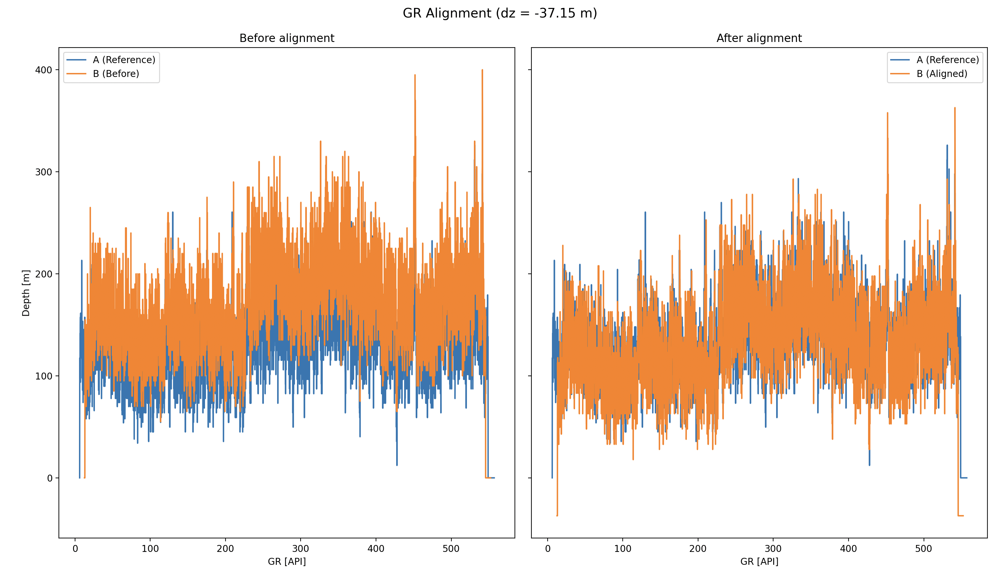

# borehole-log-alignment
Object-oriented Python project for borehole log alignment based on clustering of gamma-ray values and depth-shift correlation.

## Problem context
Borehole logs recorded at different times or with different tools often exhibit
systematic depth offsets. Accurate depth alignment is critical for log
correlation, reservoir characterization, and well-to-well comparisons.

## Example output

Gamma-ray log alignment before and after depth shifting.

